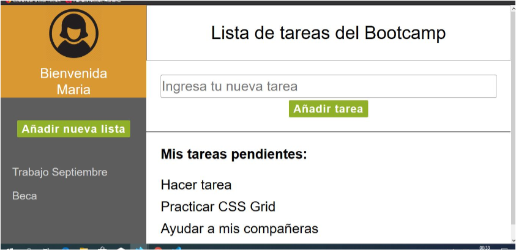

Taller BIT Institute DOM(Document Objetc Model)
===============================================

Con este taller se pretende aplicar el concepto de DOM haciendo nuestras paginas más dinamicas.
A traves de el archivo js podemos modificar directamente el documento HTML la idea es la simulación
de un login pasar a una segunda pagina donde podamos agregar tareas que se pintaran como listas.

1.Hacer una página de registro (con estilos similares a los del ejemplo) en la que sevalide la siguiente 
información: nombre, apellido, correo, contraseña, celular. Sitodos los datos están correctos, al oprimir 
el botón registrarse debe enviarnos a lapágina del punto 2.

2.La segunda página (a la que llegamos desde la página de registro) es una lista detareas (to-do list). 
La página debe tener el mismo maquetado que la del ejemplo, ytener las siguientes funcionalidades: 1) un 
input donde se ingrese la tarea; 2) unbotón que registre la tarea; 3) una sección de “tareas pendientes” 
a donde se agregala tarea cuando se da click en el botón; 4) Cuando se le da click a la tareaespecífica,
ésta se elimina; 5) (bono) La sección de “Bienvenida [nombre]” debetener el mismo nombre que se ingresó en 
la página de registro (punto 1).

Construido con 
--------------
+ HTML
+ CSS (grid)
+ JavaScript (Enfasís en document.createElement)

Autores
-----------

Lorena Leal Garcia
>>>>>>> f07304b3b14cca4b9826e32f9b25128d5fd31992
